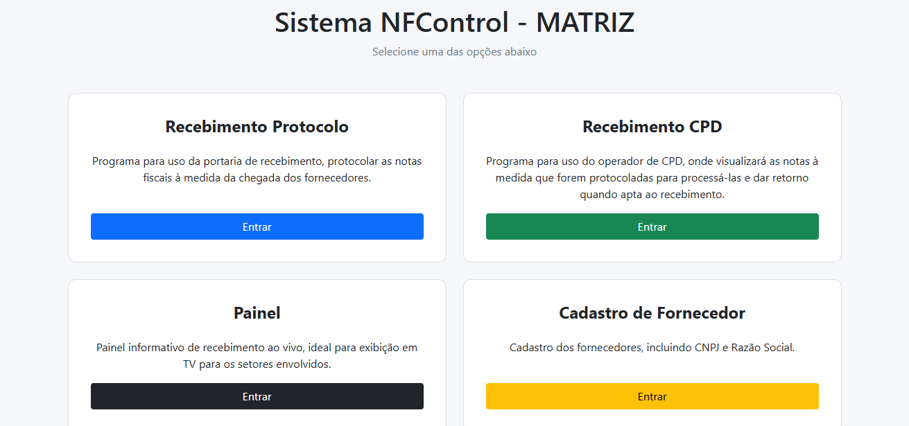
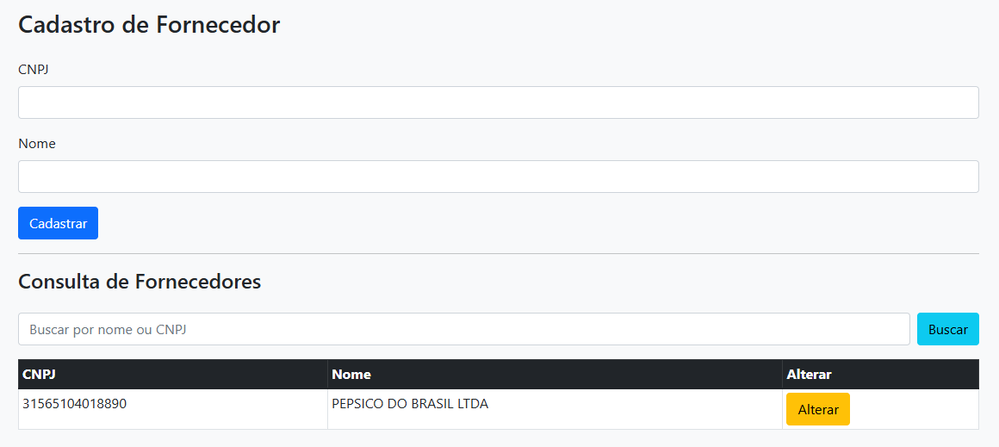
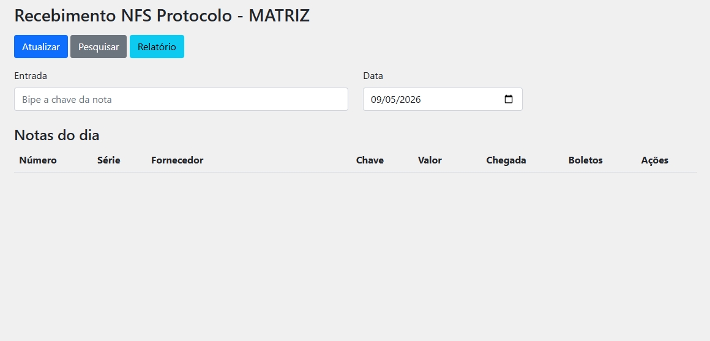
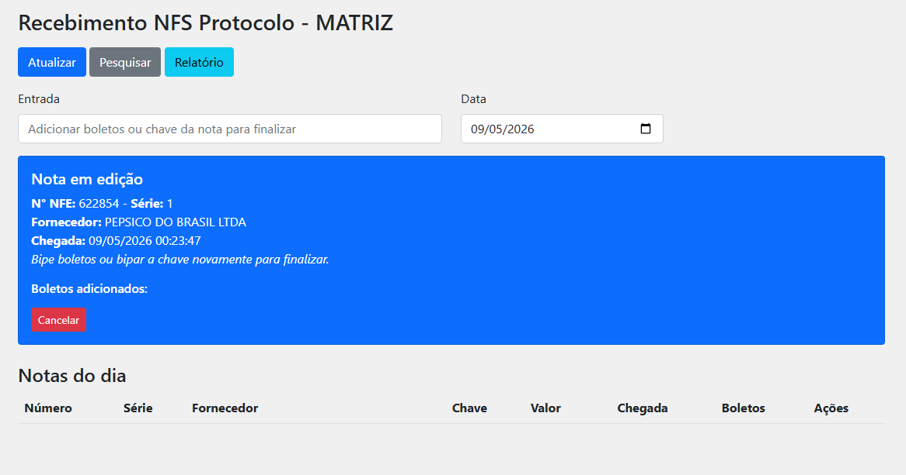
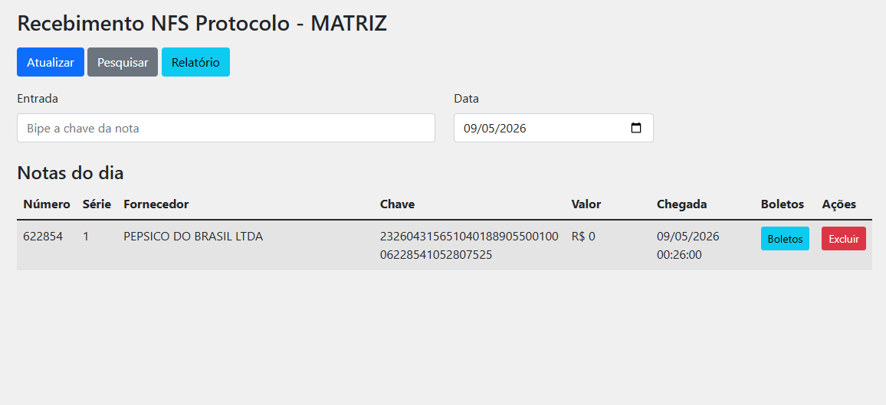
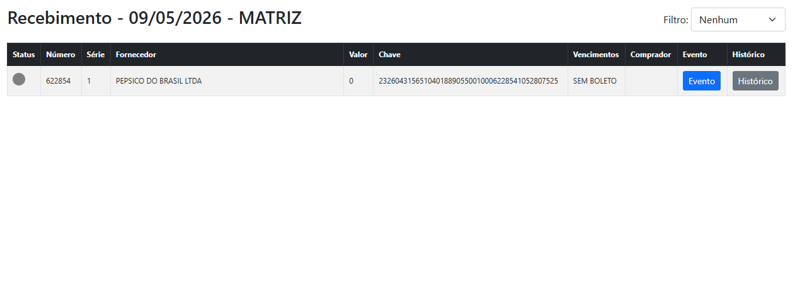
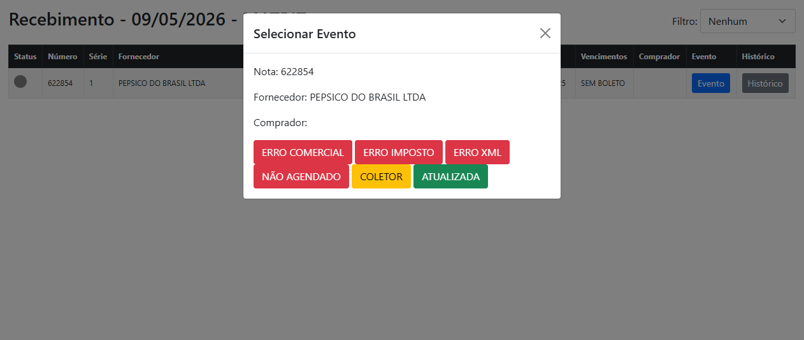
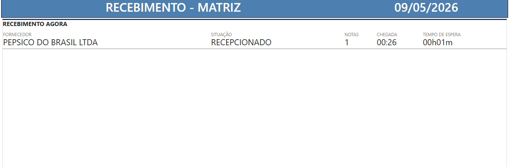
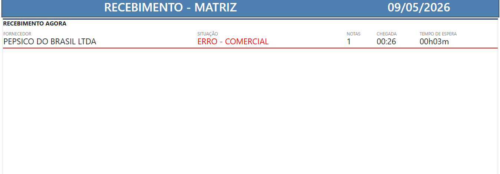
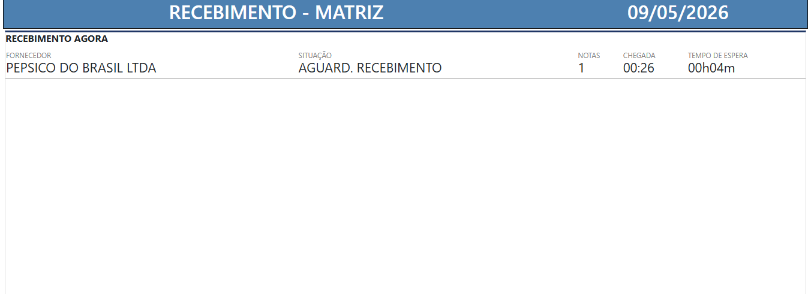

# 🧾 NFControl

Sistema corporativo para protocolo e recebimento de notas fiscais, voltado ao varejo com CPD centralizado. Oferece rastreamento em tempo real via protocolo e painel de monitoramento ao vivo para acompanhamento das operações.

## 🚀 Funcionalidades

- 🧾 Protocolo e registro de notas fiscais:
  - Permite que o conferente ou encarregado de portaria de recebimento protocole a nota fiscal, gerando registros para consultas futuras e ao mesmo tempo já envie a nota para processamento por parte do CPD.

- 📥 Processamento de nota fiscal para CPD centralizado:
  - O setor de CPD (Portaria eletronica) onde faz o processamento da nota fiscal (conferencia de pedidos, cadastros, impostos e etc.), recebe em tempo real e processa a nota dando retorno para os setores ligados (Portaria de Recebimento, Comercial, Cadastro e Físcal) atráves do painel de acompanhamento, ideal para lojas com CPD centralizado em uma Matriz.

- 📊 Painel de monitoramento do recebimento em tempo real:
  - Painel informativo em tempo real, detalhando tempo de espera e status atual do processamento dos fornecedores.

- 🏪 Controle por loja:
  - Pode ser usado por multifiliais.

## ⚙️ Requisitos, Instalação e Configuração
- Requisitos:
  - 
Servidor de sua preferência (Windows ou Linux), Apache com PHP 7.0 ou superior, Mysql ou MariaDB, XAMPP ou WAMPP server serão uma boa escolha.

- Instalação e Configuração:
  -
1. Clone o repositório
2. Configure o banco de dados utilizando o arquivo:
   banco.sql
3. Ajuste as configurações no arquivo:
   config.php
4. Execute o projeto em um servidor local

## ▶️ Como utilizar

### 1. Tela Inicial (HOME)

A tela inicial possui um menu simples e intuitivo, contendo atalhos para as principais funcionalidades do sistema.

---

### 2. Cadastro de Fornecedores

O módulo de cadastro de fornecedores é responsável por registrar os fornecedores utilizados pelo sistema.

Ao adicionar um novo fornecedor, o sistema realiza automaticamente uma verificação em todas as notas fiscais já protocoladas, inclusive de períodos anteriores, substituindo registros identificados como **"FORNECEDOR NÃO ENCONTRADO"** pelo nome correto do fornecedor.

---

### 3. Protocolando sua primeira Nota Fiscal

A página **"Recebimento Protocolo"** é responsável por iniciar o processo de recebimento da nota fiscal no sistema.  
Este módulo normalmente é utilizado pela portaria ou equipe responsável pelo recebimento físico das mercadorias.

Para iniciar o processo, basta coletar ou digitar a chave da NF-e no campo indicado.  
O sistema carregará automaticamente as informações da nota fiscal e exibirá os dados para conferência.

Após o carregamento da NF-e, o usuário poderá:

- Bipar os boletos vinculados à nota fiscal;
- Validar informações financeiras como valor e vencimento;
- Finalizar o protocolo da nota fiscal.

Essas informações são essenciais para o setor de CPD realizar as análises fiscais e comerciais.

Para concluir o processo e inserir a nota fiscal no protocolo, basta coletar ou digitar novamente a chave da NF-e.

---

### 4. Análise do CPD

Após o protocolo realizado pela portaria, o setor de CPD (Portaria Eletrônica) passa a analisar as notas fiscais recebidas.

Nesta etapa são realizadas validações como:

- Conferência de pedidos;
- Verificação de impostos;
- Conferência de cadastros;
- Análises fiscais e comerciais.

As notas fiscais ficam disponíveis na tela de recebimento do CPD em tempo real.

Durante a análise, o operador pode:

- Registrar eventos ou inconsistências encontradas;
- Informar pendências relacionadas à nota fiscal;
- Liberar a nota para recebimento;
- Finalizar o processamento após atualização no sistema.

---

### 5. Informações em tempo real no Painel

O painel de acompanhamento possui a função de informar, em tempo real, o status atual dos fornecedores e das notas fiscais em processamento.

As informações exibidas são atualizadas automaticamente conforme as ações realizadas pelo setor de CPD.

#### Fornecedor recém protocolado pela portaria

#### Nota fiscal com inconsistências

#### Nota fiscal liberada para recebimento

## 📂 Estrutura do Projeto

public/ → arquivos acessíveis via navegador  
database/ → scripts do banco de dados  
docs/ → imagens e documentação  
